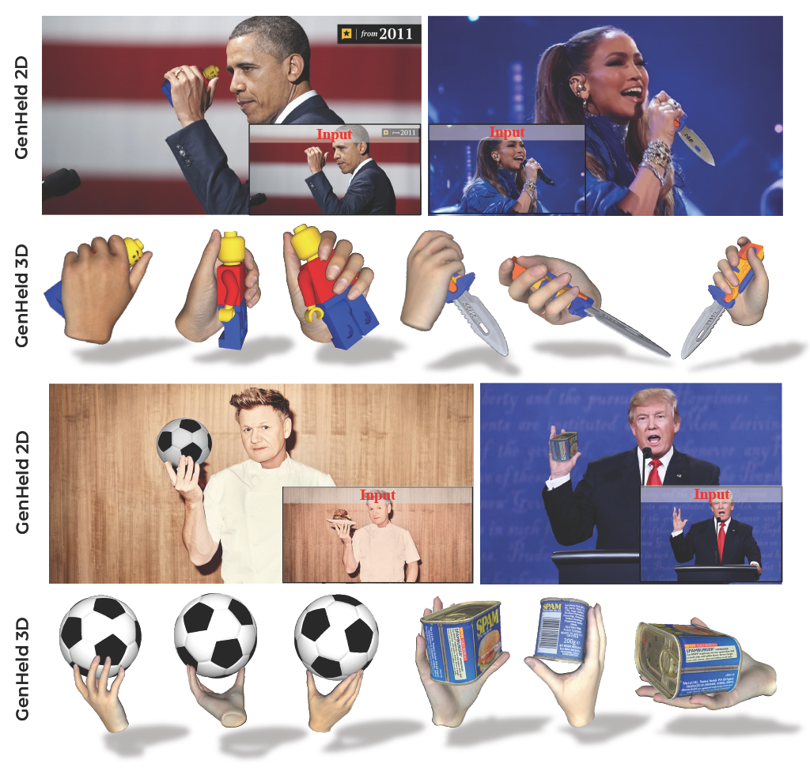
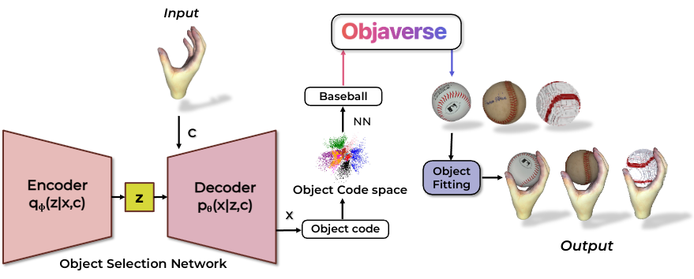
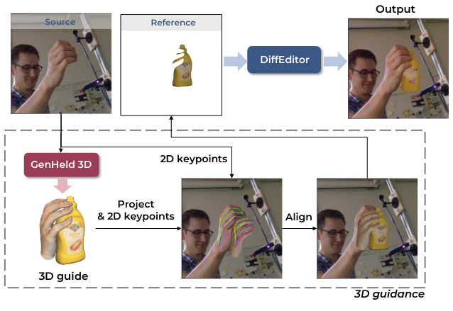
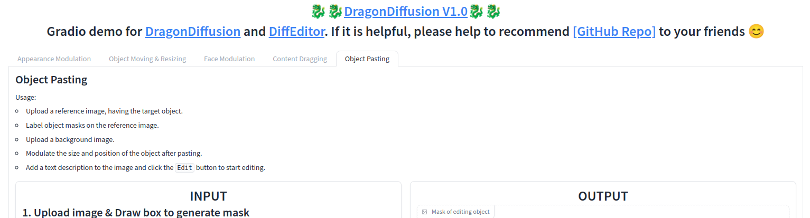

# GenHeld: Generating and Editing HandHeld Objects

### [Paper]() | [Project Page]()



# Installation

```bash
git clone --recursive https://github.com/ChaerinMin/GenHeld.git
```

This code was implemented under `Ubuntu 22.04`, `NVIDIA RTX 4060 Ti`, `cuda 11.8`, and `gcc 10.5.0`.

1. Create a conda environment
    ```bash
    conda create -n genheld python=3.8.18
    conda activate genheld
    pip install torch==2.1.1 torchvision==0.16.1 torchaudio==2.1.1 --index-url https://download.pytorch.org/whl/cu118
    ```

2. Install packages 

    ```bash
    conda install -c fvcore -c iopath -c conda-forge fvcore iopath
    pip install -r requirements.txt
    pip install -U openmim
    mim install mmcv-full==1.7.2
    ```

3. V-HACD

   Install [v-hacd](https://github.com/kmammou/v-hacd) and change `/home/cmin5/v-hacd/app/build/TestVHACD` to your own path at [configs/metric/metric.yaml](configs/metric/metric.yaml).

4. Blender

    Visit [Blender](https://www.blender.org/download/),  download, and unzip. We used version 4.0.2. If your file system is like below, 

    ```bash
    <home directory>
    |-- blender
    |   |-- lib
    |   |-- license
    |   |-- blender
    |   |-- blender.desktop
    ```

     add `<home directory>/blender` to `$PATH`.
    

# Datasets

## Required data

Download all files and folders from https://drive.google.com/drive/folders/1klKIZ7CsX0gnNH0c741VU88YeI5mOgJZ?usp=sharing and place them under `assets/` The file structure should look like below.
```bash
GenHeld
|-- assets
|   |-- contact_zones.json
|   |-- lama
|   |   |-- big-lama
|   |   |   |-- ...
|   |   |-- default.yaml
|   |-- sam
|   |   | -- sam_vit_h_4b8939.pth
|   |-- ...
|-- main.py
|-- ...
```

For reference, find [MANO](https://mano.is.tue.mpg.de/), [NIMBLE](https://github.com/reyuwei/NIMBLE_model?tab=readme-ov-file), [SMPLX](https://smpl-x.is.tue.mpg.de/), [SAM](https://github.com/facebookresearch/segment-anything), [LAMA](https://github.com/advimman/lama), [EgoHOS](https://github.com/owenzlz/EgoHOS) and [HiFiHR](https://github.com/viridityzhu/HiFiHR/tree/main?tab=readme-ov-file). We adopted the contact_zones.pkl from [Obman](https://github.com/hassony2/obman_train/tree/master), and preprocessed SMPLX arms from [HARP](https://github.com/korrawe/harp). 
    
## Hands

### [FreiHAND](https://lmb.informatik.uni-freiburg.de/resources/datasets/FreihandDataset.en.html)

Run the following code to download FreiHAND.

```bash
cd <your storage>
mkdir FreiHAND
cd FreiHAND
wget https://lmb.informatik.uni-freiburg.de/data/freihand/FreiHAND_pub_v2.zip  # 3.7GB
unzip FreiHAND_pub_v2.zip  # 4.6GB
rm FreiHAND_pub_v2.zip
cd <GenHeld>
ln -s <abs path to FreiHAND> data/
```

Then, your file system should look like below.

```bash
GenHeld
|-- data
|   |-- FreiHAND
|   |   |-- evaluation
|   |   |   |-- ...
|   |   |-- ...
|-- main.py
|-- ...
```

## Objects

### [YCB](https://www.ycbbenchmarks.com/object-models/)

Run the following code to download YCB.

```bash
python data/download_ycb.py --download_dir <your storage>
ln -s <abs path to YCB> data/
```

Then, your file system should look like below.

```bash
GenHeld
|-- data
|   |-- FreiHAND
|   |   |-- evaluation
|   |   |-- ...
|   |-- YCB
|   |   |-- 001_chips_can
|   |   |-- ...
|-- main.py
|-- ...
```

### [Objaverse](https://objaverse.allenai.org/)

Download the preprocessed data from https://drive.google.com/drive/folders/1xVGupsuKQnV8GSOnLJepU0FUBPqsv5zy?usp=sharing and make symbolic link if you want, `ln -s <abs path to Objaverse> data/` 

Then, your file system should look like below.

```bash
GenHeld
|-- data
|   |-- FreiHAND
|   |   |-- evaluation
|   |   |-- ...
|   |-- YCB
|   |   |-- 001_chips_can
|   |   |-- ...
|   |-- Objaverse
|   |   |-- banana
|   |   |-- ...
|-- main.py
|-- ...
```

# GenHeld 3D



## Object Selection Network

To use the **pretrained** Object Selection network, make sure the path to the checkpoint is same as ckpt_path under selector in the `configs/config.yaml` file. Then, <span style="color:red">proceed to the Object Fitting</span>.

If you want to train by yourself,  download [DexYCB](https://dex-ycb.github.io/) and place it under `data/` with name `DexYCB`, and run

```bash
python main.py selector.mode=train selector.ckpt_path=""
```

## Object Fitting 

We provide the pre-fitted results at https://drive.google.com/drive/folders/1ADdnR9WYFwQ5KUn0YdXnf0jpV0GhceVd?usp=sharing Make a directory named `outputs/prefit` and put the files under it. 

```bash
GenHeld
|-- outputs
|   |-- prefit
|   |   |-- checkpoints
|   |   |-- ...
|-- main.py
```

To run the evaluation, 

```bash
python main.py object_dataset=ycb select_object=category selector.ckpt_path=assets/selector_checkpoints/epoch=151-step=456.ckpt optimizer.mode=evaluate optimizer.resume_dir=outputs/prefit/
```

### Object fitting by yourself

You might want to run the Object Selection Network and fit the object by yourself. To do this, 


```bash
python main.py optimizer.mode=optimize
```

# GenHeld 2D



We hinge our GenHeld3D upon [DiffEditor](https://github.com/MC-E/DragonDiffusion) to achieve GenHeld2D. Install [DiffEditor](https://github.com/MC-E/DragonDiffusion) and open the gradio (`python app.py`). 


In the `Object pasting` tab, put the input image as `Original image` and put the `xx_warped.png` as `Reference image`. `xx_warped.png` will be under either `outputs/xx/xx/evaluations` (if you only run evaluation) or `outputs/xx/xx/results`. Make a box around the object and run. 



# Citation
